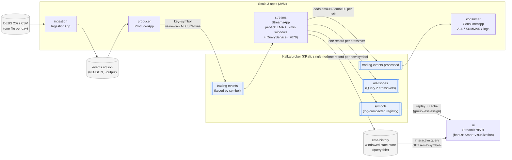
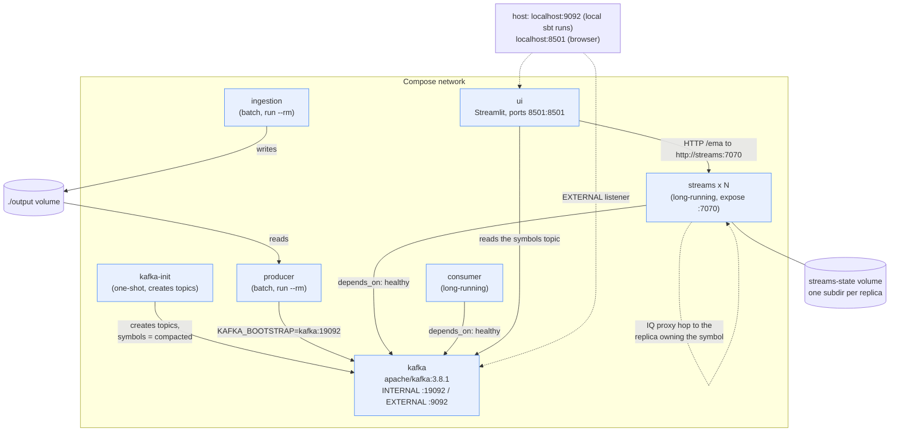
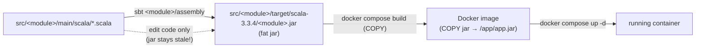
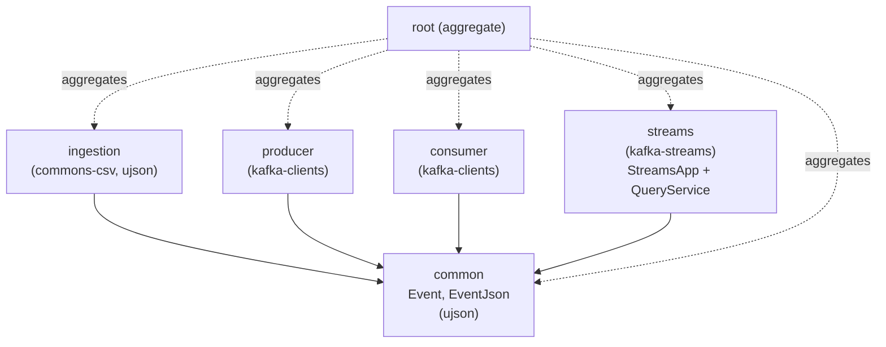

# Architecture Diagrams

Mermaid diagrams of the Kafka pipeline for the CS-E4780 trading-tick project.
See [`KAFKA_PLAN.md`](KAFKA_PLAN.md) for the prose plan and the
plan.png → assignment commentary.

## Data flow (runtime)

How events move from the raw CSV through Kafka to the consumer/UI.

## Deployment (Docker Compose)

Each app is a fat jar baked into an image via one shared `Dockerfile`
(`ARG MODULE` / `ARG MAIN_CLASS`). All services share one Compose network and
reach the broker at `kafka:19092` (internal); the host uses `localhost:9092`.

## Build flow (source → running container)

Why `docker compose up --build` alone is not enough after a code change: the
image only **copies** a pre-built jar; it never compiles. Re-run `sbt assembly`
first so the jar is fresh, then rebuild the image.

## Module dependencies (sbt build)

## Design motivation

Why the system is put together this way. The through-line is that the assignment
is a *scalability* exercise: 289 million events, 5504 symbols, and a UI that must
stay responsive while the pipeline is saturated.

### Symbol is the partition key, end to end

The producer sets `key = symbol` and nothing downstream re-keys. That single
decision buys three things at once:

- **Per-symbol ordering.** Kafka guarantees order within a partition, so a
  symbol's events arrive in order even though the assignment says no total order
  exists across exchanges.
- **Stateful operators need no repartition.** `groupByKey()` on an
  already-correctly-keyed stream inserts no repartition topic, so the whole
  topology is a single sub-topology and the EMA state for a symbol lives on the
  same instance that processes its events.
- **Interactive queries are routable.** Because store partitioning matches input
  partitioning, `queryMetadataForKey` can name the instance holding any symbol.

Parallelism is then bounded by partition count, which is why `kafka-init`
creates topics with 6 partitions instead of letting auto-creation make them with
1. A 1-partition topic would pin the streams app to a single task no matter how
many replicas were running.

### Query 1 and Query 2 in one pass

Both queries are computed in the same topology from the same windowed aggregate.
Query 2 is a pure function of consecutive Query 1 outputs, so recomputing or
re-reading the EMAs to detect crossovers would be wasted work. The crossover is
detected in the same step that advances the EMA recurrence, and the resulting
signal is written *into* the history record rather than only to a topic — so the
UI draws lines and markers from one query instead of joining two streams.

### Suppression is a correctness requirement, not an optimisation

A windowed `KTable.toStream()` emits on *every* update, which would apply the EMA
recurrence once per input event instead of once per window. The assignment is
explicit that window `w_i` is evaluated when `w_{i+1}` starts, so the topology
uses `Suppressed.untilWindowCloses`. This also collapses the advisory topic from
one record per tick to one record per genuine crossover.

### The symbol registry is a compacted topic

The UI needs the list of symbols that actually have data. Deriving it by scanning
the event stream in the UI would mean reading 289M events to learn 5504 facts.
Instead the streams app dedupes symbols against a state store and writes each one
exactly once to a **log-compacted** topic.

Compaction is what makes this cheap: the retained log is bounded by symbol
*cardinality*, not event volume, so a cold UI replays a few thousand records
regardless of how long the pipeline has been running. Measured on one day of
data: 837 symbols over 6 partitions, read in 0.14 s.

The UI reads it with `assign` rather than `subscribe`, deliberately. It is not a
consumer-group member, so N UI replicas never rebalance against each other and no
offsets are committed — the read is a bounded, idempotent snapshot, safe to redo
whenever the cache expires.

### EMA history comes from interactive queries, not a topic

The obvious alternative — have the UI consume an EMA topic into memory — was
rejected:

- That state is **already materialised** in the `ema-history` window store.
  Consuming it again would duplicate it in every UI replica, growing memory
  linearly with replica count.
- History would be capped by **topic retention** rather than by store retention.
- Every UI replica would have to read **all** symbols to serve **one**.

Serving from the store instead means the UI fetches exactly the symbol and time
range it is drawing. Because the store is partitioned, the queried instance may
not own the symbol; `QueryService` looks up the owner with `queryMetadataForKey`
and proxies to it, so **any replica can answer any query**. That is why `streams`
uses `expose` rather than `ports`: publishing a host port would prevent
`docker compose up --scale streams=3`, and the UI simply talks to the service
name while Docker DNS hands it an arbitrary replica.

Each replica advertises its **own container IP** via `APPLICATION_SERVER_CONFIG`.
A value shared by all replicas (such as the service name) would make every lookup
resolve to whichever instance registered last.

### Window-store changelogs need `retention.ms=-1` for a historical replay

Kafka Streams gives window-store changelogs `cleanup.policy=compact,delete` with
a retention derived from the store's retention period. Those records carry
**event** timestamps, and this data set is a replay of November 2021 — so every
changelog record is years older than any sane retention and the broker deletes
the entire changelog almost as fast as it is written. The symptom is subtle: the
pipeline works, but a restarted instance restores an **empty** store and the UI
silently shows nothing. (Key-value store changelogs are compact-only, which is
why they survive and mask the problem.)

Setting `retention.ms=-1` on the windowed stores disables time-based deletion
while compaction still bounds the topic to one record per `(symbol, window)`.
This is what makes the UI's history survive a restart or a rescale.

### State directories are per-replica

Kafka Streams takes an exclusive lock on its state directory, so replicas sharing
one volume cannot start. Each instance therefore gets a subdirectory keyed by
container hostname inside the shared `streams-state` volume. An instance that
comes back with a new hostname simply restores from the changelog topics — which
is precisely what makes Streams state fault-tolerant, and is exercised whenever
the stack is rescaled.

### Where the work happens

The UI holds no pipeline state. It renders, filters, and issues one HTTP query
per chart refresh; the symbol list is cached for `SYMBOL_CACHE_TTL` seconds and
the chart lives in an `st.fragment` so its timer does not re-read Kafka. Scaling
the UI is therefore trivial — the expensive, stateful work stays in Kafka Streams
where it can be scaled by adding replicas up to the partition count.
