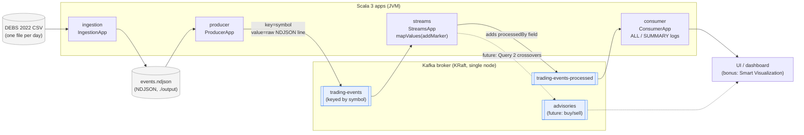
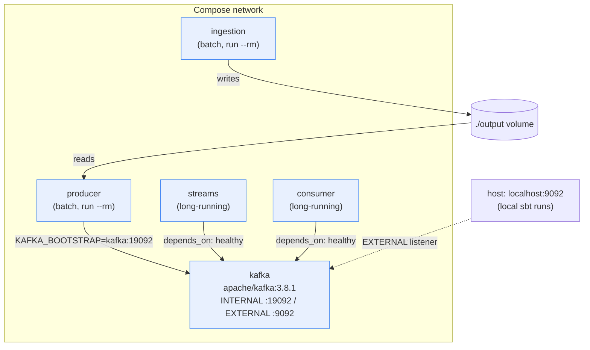
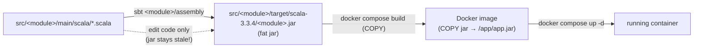
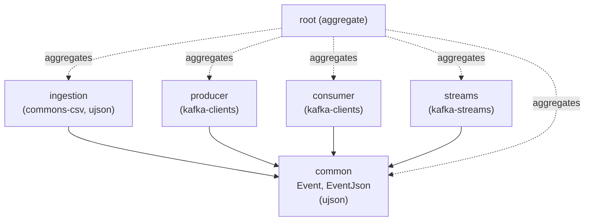

# Architecture Diagrams

Mermaid diagrams of the Kafka pipeline for the CS-E4780 trading-tick project.
See [`KAFKA_PLAN.md`](KAFKA_PLAN.md) for the prose plan and the
plan.png → assignment commentary.

## Data flow (runtime)

How events move from the raw CSV through Kafka to the consumer/UI.

## Deployment (Docker Compose)

Each app is a fat jar baked into an image via one shared `Dockerfile`
(`ARG MODULE` / `ARG MAIN_CLASS`). All services share one Compose network and
reach the broker at `kafka:19092` (internal); the host uses `localhost:9092`.

## Build flow (source → running container)

Why `docker compose up --build` alone is not enough after a code change: the
image only **copies** a pre-built jar; it never compiles. Re-run `sbt assembly`
first so the jar is fresh, then rebuild the image.

## Module dependencies (sbt build)

